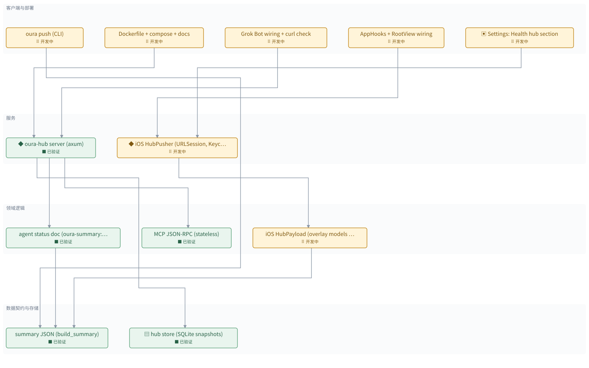

# Health hub: 24/7 MCP endpoint for Grok Bot \(step 1 ring hub, step 2 iOS push\)

[所有地图](index.md)

> 自动生成的地图预览；修改地图数据后重新生成。

**当前：** oura push \(CLI\)、Dockerfile \+ compose \+ docs、Grok Bot wiring \+ curl check、iOS HubPayload \(overlay models on FFI JSON\)、iOS HubPusher \(URLSession, Keychain token\)、AppHooks \+ RootView wiring、Settings: Health hub section

已验证 **5 / 12**　｜　回归 **0**

## 分层依赖

· 待开发　⠿ 开发中　■ 已验证　✗ 出现回归　□ 完成但缺少证据

箭头由使用方指向它依赖的模块；基础层位于下方。

## 模块详情

### 客户端与部署

#### oura push \(CLI\)　⠿ 开发中

oura push \-\-to URL \-\-token T \(or $OURA\_HUB\_TOKEN\) \-\-tz\-offset H: build\_summary with PythonRunner, POST via ureq, prints the hub reply\. Committed in 4046286\. Not yet run against a real oura\.db \+ hub\.

**依赖：** summary JSON \(build\_summary\)（POST body）

#### Dockerfile \+ compose \+ docs　⠿ 开发中

Dockerfile \(rust:1\.93 build stage, debian slim runtime, /data volume, healthcheck\), \.dockerignore, docker\-compose\.yml \(127\.0\.0\.1:8787, OURA\_HUB\_TOKEN required\), docs/health\-hub\.md, README row\. \`docker build\` NOT verified: the Docker daemon was not running on this Mac\.

**依赖：** oura\-hub server \(axum\)

#### Grok Bot wiring \+ curl check　⠿ 开发中

curl check passed locally \(initialize, tools/list, tools/call get\_status\_now\)\. Grok Bot mcpServers entry \{url: https://host/mcp/&lt;token&gt;\} waits on the user's server URL\. Doc has the snippet and a planning prompt\.

**依赖：** oura\-hub server \(axum\)（MCP over HTTPS）

#### AppHooks \+ RootView wiring　⠿ 开发中

afterSync: push the base summary with the previous full summary's models overlaid; after bgProcessing models, push the full one\. RootView\.load: push after the foreground model run\. Core\.baseWithJson keeps the raw JSON so the summary is built once\.

**依赖：** iOS HubPusher \(URLSession, Keychain token\)（push after sync）

#### Settings: Health hub section　⠿ 开发中

ProfileSettingsView: toggle, URL field, token SecureField, Push Now, status line with last success / error\.

**依赖：** iOS HubPusher \(URLSession, Keychain token\)（settings, Push Now）

**归属 / 类型：** ui

### 服务

#### oura\-hub server \(axum\)　■ 已验证

Binary oura\-hub\. Env OURA\_HUB\_TOKEN, OURA\_HUB\_BIND \(0\.0\.0\.0:8787\), OURA\_HUB\_DB\. Routes: GET /health, POST /ingest/summary \(Bearer\), POST /mcp and /mcp/&lt;token&gt;\. Registers tools get\_status\_now, get\_sleep, get\_trends, get\_activity over the latest snapshot\. Token in path because Grok Bot config has url only\. TLS is the reverse proxy's job\.

**依赖：** hub store \(SQLite snapshots\)（snapshots）、MCP JSON\-RPC \(stateless\)（POST /mcp）、agent status doc \(oura\-summary::agent\)（tool results）

**归属 / 类型：** service

**验证记录：** tests/http\.rs 4 passed; release binary smoke: /health, /ingest/summary, /mcp/&lt;token&gt; initialize \+ get\_status\_now via curl OK

#### iOS HubPusher \(URLSession, Keychain token\)　⠿ 开发中

HubSettings: url \+ enabled in UserDefaults, token in Keychain \(AfterFirstUnlock so a locked\-phone background sync can push\)\. HubPusher\.push builds the payload, skips an unchanged SHA\-256, POSTs to &lt;url&gt;/ingest/summary with Bearer, timeout 8 s on bgRefresh else 20 s, publishes HubPushStatus for the UI\.

**依赖：** iOS HubPayload \(overlay models on FFI JSON\)（body）

**归属 / 类型：** service

### 领域逻辑

#### agent status doc \(oura\-summary::agent\)　■ 已验证

Pure fn status\_from\_summary\(&amp;Value, now\) \-&gt; Value: last night, sleep debt, HRV/RHR vs baseline, illness state, today activity, latest HR, plus freshness \(generated\_at, age\_min\)\. Also sleep\_nights\(days\), trends\(metric, days\)\. Lives in oura\-summary so iOS can reuse it in step 2\. Unit tests on a fixture summary\.

**依赖：** summary JSON \(build\_summary\)（reads）

**验证记录：** cargo test \-p oura\-summary agent: 6 passed \(open\_health/crates/oura\-summary/src/agent\.rs\)

#### MCP JSON\-RPC \(stateless\)　■ 已验证

Hand\-rolled Streamable HTTP MCP, protocol 2025\-06\-18: initialize, notifications/initialized, ping, tools/list, tools/call\. Generic over a tool table; returns application/json \(no SSE\)\. No sessions\. Errors as JSON\-RPC errors\. Unit tests with fixed requests\.

**依赖：** 无

**验证记录：** cargo test \-p oura\-hub mcp: 4 passed \(initialize, notifications, tools/list\+call, error codes\)

#### iOS HubPayload \(overlay models on FFI JSON\)　⠿ 开发中

Pure: take the raw summaryJson string from oura\-core and fold the on\-device model results in \(night stages by start\_ds, sleep\_debt only when its valid\_days covers at least as much, cardio, illness, workouts\)\. The Swift Summary struct drops fields the agent doc needs \(generated\_at, tz, metrics\), so the raw JSON is the base, never the re\-encoded struct\. Unit\-tested\.

**依赖：** summary JSON \(build\_summary\)（raw FFI JSON）

### 数据契约与存储

#### summary JSON \(build\_summary\)　■ 已验证

The one JSON both clients render: nights, sleep\_debt, illness, cardio, activity, activity\_daily, vitals, device, generated\_at, digest\. Unchanged in this effort; the hub stores it as\-is\.

**依赖：** 无

**验证记录：** existing oura\-summary::build\_summary, served by oura dashboard GET /api/summary

#### hub store \(SQLite snapshots\)　■ 已验证

rusqlite table snapshots\(received\_at, generated\_at, digest, body\)\. Keeps latest \+ history so freshness is honest\. Idempotent on digest\.

**依赖：** 无

**归属 / 类型：** db

**验证记录：** cargo test \-p oura\-hub store: 2 passed \(put/dedup/latest, prune\)

## 验证记录

| 模块 | 状态 | 最近证据 |
| --- | --- | --- |
| summary JSON \(build\_summary\) | ■ 已验证 | existing oura\-summary::build\_summary, served by oura dashboard GET /api/summary |
| hub store \(SQLite snapshots\) | ■ 已验证 | cargo test \-p oura\-hub store: 2 passed \(put/dedup/latest, prune\) |
| agent status doc \(oura\-summary::agent\) | ■ 已验证 | cargo test \-p oura\-summary agent: 6 passed \(open\_health/crates/oura\-summary/src/agent\.rs\) |
| MCP JSON\-RPC \(stateless\) | ■ 已验证 | cargo test \-p oura\-hub mcp: 4 passed \(initialize, notifications, tools/list\+call, error codes\) |
| oura\-hub server \(axum\) | ■ 已验证 | tests/http\.rs 4 passed; release binary smoke: /health, /ingest/summary, /mcp/&lt;token&gt; initialize \+ get\_status\_now via curl OK |
| oura push \(CLI\) | ⠿ 开发中 | 尚未记录 |
| Dockerfile \+ compose \+ docs | ⠿ 开发中 | 尚未记录 |
| Grok Bot wiring \+ curl check | ⠿ 开发中 | 尚未记录 |
| iOS HubPayload \(overlay models on FFI JSON\) | ⠿ 开发中 | 尚未记录 |
| iOS HubPusher \(URLSession, Keychain token\) | ⠿ 开发中 | 尚未记录 |
| AppHooks \+ RootView wiring | ⠿ 开发中 | 尚未记录 |
| Settings: Health hub section | ⠿ 开发中 | 尚未记录 |

---

静态文档：更新时重新生成地图图片与文字。图中节点不支持拖拽、悬停展开或动画。
