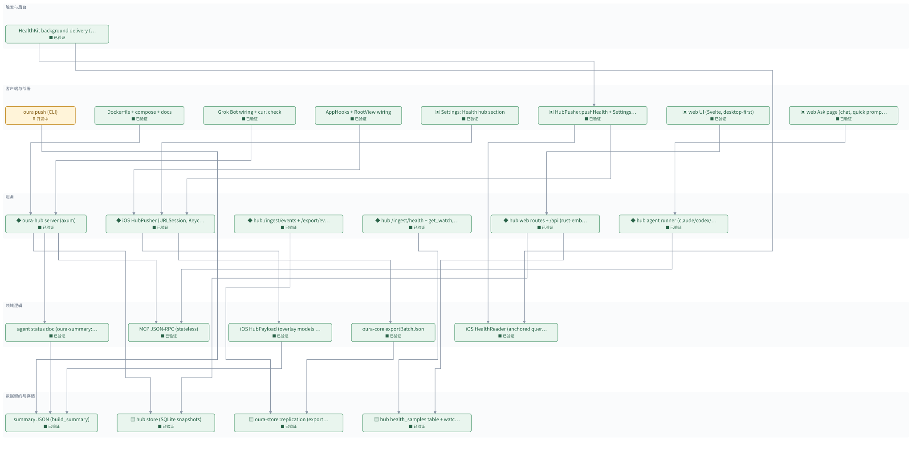

# Health hub: 24/7 MCP endpoint for Grok Bot \(step 1 ring hub, step 2 iOS push\)

[所有地图](index.md)

> 自动生成的地图预览；修改地图数据后重新生成。

**当前：** oura push \(CLI\)

已验证 **23 / 24**　｜　回归 **0**

## 分层依赖

· 待开发　⠿ 开发中　■ 已验证　✗ 出现回归　□ 完成但缺少证据

箭头由使用方指向它依赖的模块；基础层位于下方。

## 模块详情

### 触发与后台

#### HealthKit background delivery \(observer \+ wake\)　■ 已验证

HKObserverQuery per type, registered at launch in AppDelegate before launch ends; enableBackgroundDelivery on the toggle \(hourly for the step/energy/time kinds HealthKit limits, immediate for the rest\); disableAll on switch\-off\. HealthWake actor coalesces the burst of per\-type callbacks into one pushHealth under a KeepAlive assertion, calls every completion handler afterwards, and reruns once for wakes that arrived mid\-push\. Unit\-tested with a fake client and a fake push\.

**依赖：** HubPusher\.pushHealth \+ Settings toggle（pushHealth on wake）、iOS HealthReader \(anchored queries, encoder\)（observe types）

**验证记录：** HealthBackgroundTests 4 passed; simulator: Health\-app sample reached the hub via the observer \(hk\-wake task logged\) without Send Now; XCTest 37 passed

### 客户端与部署

#### oura push \(CLI\)　⠿ 开发中

oura push \-\-to URL \-\-token T \(or $OURA\_HUB\_TOKEN\) \-\-tz\-offset H: build\_summary with PythonRunner, POST via ureq, prints the hub reply\. Committed in 4046286\. Not yet run against a real oura\.db \+ hub\.

**依赖：** summary JSON \(build\_summary\)（POST body）

#### Dockerfile \+ compose \+ docs　■ 已验证

Dockerfile \(rust:1\.93 build, debian slim runtime, /data volume, healthcheck\), \.dockerignore, docker\-compose\.yml, docs/health\-hub\.md with the Ubuntu \+ Tailscale serve recipe\. docker build still unverified here \(no Docker daemon on the Mac\); the build context now works because the \[patch\] is gone\.

**依赖：** oura\-hub server \(axum\)

**验证记录：** Steam Deck: podman build \+ run OK, /health from the Mac over the tailnet \(http://steamdeck\.<tailnet>\.ts\.net:8787\); podman\-restart \+ linger; docs have the podman/Deck recipe

#### Grok Bot wiring \+ curl check　■ 已验证

curl check passed locally \(initialize, tools/list, tools/call get\_status\_now\)\. Grok Bot mcpServers entry \{url: https://host/mcp/&lt;token&gt;\} waits on the user's server URL\. Doc has the snippet and a planning prompt\.

**依赖：** oura\-hub server \(axum\)（MCP over HTTPS）

**验证记录：** \~/\.cursor/mcp\.json has the health entry; MCP initialize \+ tools/call answered over the tailnet from the Mac \(get\_status\_now: no data yet, as expected before the first phone push\)

#### AppHooks \+ RootView wiring　■ 已验证

afterSync: push the base summary with the previous full summary's models overlaid; after bgProcessing models, push the full one\. RootView\.load: push after the foreground model run\. Core\.baseWithJson keeps the raw JSON so the summary is built once\.

**依赖：** iOS HubPusher \(URLSession, Keychain token\)（push after sync）

**验证记录：** xcodebuild build OK; foreground push wired in RootView\.load; afterSync wiring compiled \(background path not exercised: no ring in the simulator\)

#### Settings: Health hub section　■ 已验证

ProfileSettingsView: toggle, URL field, token SecureField, Push Now, status line with last success / error\.

**依赖：** iOS HubPusher \(URLSession, Keychain token\)（settings, Push Now）

**归属 / 类型：** ui

**验证记录：** Simulator: toggle, URL, token, Send Now, status line rendered and worked \(screenshots sim5\-sim9\)

#### HubPusher\.pushHealth \+ Settings toggle　■ 已验证

After the ring rows, send HealthKit pages until the deadline; anchors advance per accepted page\. Settings: 'Include Apple Health data' toggle requests read authorization; status line shows last run and counts\.

**依赖：** iOS HealthReader \(anchored queries, encoder\)（pages）、iOS HubPusher \(URLSession, Keychain token\)（same targets/token）

**归属 / 类型：** ui

**验证记录：** Simulator E2E: toggle → HealthKit authorization sheet → Send Now; a 77 bpm sample entered in the Health app reached the hub, the app's own 5406 exported samples were excluded; XCTest 33 passed

#### web UI \(Svelte, desktop\-first\)　■ 已验证

oura\-hub/web: Vite \+ Svelte 5 \+ TS, lucide icons, SVG charts \(Sparkline, TrendChart, Hypnogram with hour ticks, Ridge, Lane, ScoreRing, ScoreBreakdown\)\. Sidebar \+ 12\-column grid, big numbers, explanatory copy\. Pages: Summary, Sleep, Trends, Data\. Token kept in localStorage; auto\-refresh on visibility and every 10 min\.

**依赖：** hub web routes \+ /api \(rust\-embed\)（fetch /api/\*）

**归属 / 类型：** ui

**验证记录：** svelte\-check 0 errors; all four pages rendered real data in the built\-in browser with no console errors; deployed on the Deck \(aea93b9\)

#### web Ask page \(chat, quick prompts\)　■ 已验证

pages/Ask\.svelte: provider list with availability \+ login hint, quick prompts, chat thread, SSE parsing via fetch streams, per\-provider session ids in localStorage, New conversation\.

**依赖：** hub agent runner \(claude/codex/cursor subprocess, SSE\)（POST /api/agent/ask）

**归属 / 类型：** ui

**验证记录：** svelte\-check 0 errors; fake\-provider run rendered the tool chip, the streamed answer, and kept the session id

### 服务

#### oura\-hub server \(axum\)　■ 已验证

Binary oura\-hub\. Env OURA\_HUB\_TOKEN, OURA\_HUB\_BIND \(0\.0\.0\.0:8787\), OURA\_HUB\_DB\. Routes: GET /health, POST /ingest/summary \(Bearer\), POST /mcp and /mcp/&lt;token&gt;\. Registers tools get\_status\_now, get\_sleep, get\_trends, get\_activity over the latest snapshot\. Token in path because Grok Bot config has url only\. TLS is the reverse proxy's job\.

**依赖：** hub store \(SQLite snapshots\)（snapshots）、MCP JSON\-RPC \(stateless\)（POST /mcp）、agent status doc \(oura\-summary::agent\)（tool results）

**归属 / 类型：** service

**验证记录：** tests/http\.rs 4 passed; release binary smoke: /health, /ingest/summary, /mcp/&lt;token&gt; initialize \+ get\_status\_now via curl OK

#### iOS HubPusher \(URLSession, Keychain token\)　■ 已验证

HubSettings: url \+ enabled in UserDefaults, token in Keychain \(AfterFirstUnlock\), replication cursor ids \+ last summary SHA in UserDefaults\. HubPusher\.pushAll: summary first \(skip unchanged SHA\), then pages of raw rows to POST /ingest/events until the deadline \(8 s on bgRefresh, 40 s otherwise, 60 s foreground, 120 s manual\)\. Never sends the bundled seed DB\.

**依赖：** iOS HubPayload \(overlay models on FFI JSON\)（body）、oura\-core exportBatchJson（pages of rows）

**归属 / 类型：** service

**验证记录：** Simulator E2E: Send Now pushed summary \+ 12580 rows to a local hub; /health max\_event\_id 12580; status line updated; full XCTest suite 28 passed

#### hub /ingest/events \+ /export/events \(ring replica\)　■ 已验证

Second SQLite file OURA\_HUB\_RING\_DB \(default oura\.db next to hub\.db\) with the oura\-store schema: a full replica\. oura dashboard \-\-db runs on it\. The iOS pusher and oura push talk to it over HTTPS \(peers, no build dependency\)\.

**依赖：** oura\-store::replication \(export/import rows\)（import\_batch / export\_after）

**归属 / 类型：** service

**验证记录：** tests/http\.rs ring\_rows\_round\_trip\_through\_the\_replica passed \(auth, import, dedup, /health ids, paged export, schema\-too\-new 422\)

#### hub /ingest/health \+ get\_watch, get\_health\_samples　■ 已验证

Bearer\. Body \{tz\_offset\_s, samples\[\], deleted\[\]\}\. get\_status\_now gains a watch block\. get\_health\_samples\(kind, days, limit\) returns raw rows\.

**依赖：** hub health\_samples table \+ watch summary（put/query）

**归属 / 类型：** service

**验证记录：** tests/http\.rs health\_samples\_round\_trip\_and\_fold\_into\_status passed; live: /ingest/health from the simulator, get\_watch returned the Health\-app sample

#### hub web routes \+ /api \(rust\-embed\)　■ 已验证

src/web\.rs: GET / and /\{\*path\} serve web/dist embedded with rust\-embed \(SPA fallback, 'not built' page when dist is empty; build\.rs creates the folder\)\. GET /api/session, GET /api/summary \(latest snapshot\), POST /api/tool/\{name\} \(the MCP handler\), all Bearer\.

**依赖：** hub store \(SQLite snapshots\)（latest snapshot）、hub health\_samples table \+ watch summary（watch tools）

**归属 / 类型：** service

**验证记录：** tests/http\.rs web\_api\_needs\_the\_token\_and\_reuses\_the\_tools passed; live on the Deck: GET / serves the built app, /api/\* answered with the token

#### hub agent runner \(claude/codex/cursor subprocess, SSE\)　■ 已验证

src/agent\.rs: AgentConfig detects the CLIs, writes MCP configs \(loopback hub URL with token, 0600\), builds each CLI's command \(Claude: \-p stream\-json \+ \-\-mcp\-config \+ allowed mcp tools \+ \-\-append\-system\-prompt RULES; Codex: exec \-\-json \-c mcp\_servers\.health\.url; Cursor: \-p stream\-json \-\-approve\-mcps with \.cursor/mcp\.json\), maps JSON lines to Event, streams over mpsc\. POST /api/agent/ask = SSE; GET /api/agent/providers\. Same bearer auth as the web API\.

**依赖：** MCP JSON\-RPC \(stateless\)（CLI calls the hub MCP）

**归属 / 类型：** service

**验证记录：** cargo test: agent parsers \+ fake\-CLI stream \+ route tests passed \(24 total\); browser E2E with a fake claude script streamed a tool chip and the answer

### 领域逻辑

#### agent status doc \(oura\-summary::agent\)　■ 已验证

Pure fn status\_from\_summary\(&amp;Value, now\) \-&gt; Value: last night, sleep debt, HRV/RHR vs baseline, illness state, today activity, latest HR, plus freshness \(generated\_at, age\_min\)\. Also sleep\_nights\(days\), trends\(metric, days\)\. Lives in oura\-summary so iOS can reuse it in step 2\. Unit tests on a fixture summary\.

**依赖：** summary JSON \(build\_summary\)（reads）

**验证记录：** cargo test \-p oura\-summary agent: 6 passed \(open\_health/crates/oura\-summary/src/agent\.rs\)

#### MCP JSON\-RPC \(stateless\)　■ 已验证

Hand\-rolled Streamable HTTP MCP, protocol 2025\-06\-18: initialize, notifications/initialized, ping, tools/list, tools/call\. Generic over a tool table; returns application/json \(no SSE\)\. No sessions\. Errors as JSON\-RPC errors\. Unit tests with fixed requests\.

**依赖：** 无

**验证记录：** cargo test \-p oura\-hub mcp: 4 passed \(initialize, notifications, tools/list\+call, error codes\)

#### iOS HubPayload \(overlay models on FFI JSON\)　■ 已验证

Pure: take the raw summaryJson string from oura\-core and fold the on\-device model results in \(night stages by start\_ds, sleep\_debt only when its valid\_days covers at least as much, cardio, illness, workouts\)\. The Swift Summary struct drops fields the agent doc needs \(generated\_at, tz, metrics\), so the raw JSON is the base, never the re\-encoded struct\. Unit\-tested\.

**依赖：** summary JSON \(build\_summary\)（raw FFI JSON）

**验证记录：** HubPushTests 7 passed \(overlay, debt window rule, pass\-through, rejects, endpoints, request, batch head\)

#### oura\-core exportBatchJson　■ 已验证

\#\[uniffi::export\] export\_batch\_json\(db\_path, after\_event\_id, after\_reading\_id, limit\) \-&gt; ExportBatch JSON or \{error\}\. Needs the xcframework rebuild \(apps/ios/build\-xcframework\.sh\)\.

**依赖：** oura\-store::replication \(export/import rows\)（export\_after）

**验证记录：** build\-xcframework\.sh OK; generated oura\_core\.swift has exportBatchJson; used by the simulator E2E push

#### iOS HealthReader \(anchored queries, encoder\)　■ 已验证

HKAnchoredObjectQuery per type with persisted anchors \(health\-read\-state\.json next to the DB\), pages of 2000, own\-source samples excluded \(no loop with the exporter\)\. Encoder maps HKQuantitySample / HKCategorySample / HKWorkout to the hub row\. Fake client in tests\.

**依赖：** 无

**验证记录：** HealthReaderTests 5 passed \(encoder, paging \+ own\-source exclusion \+ anchors, send failure keeps anchor, deadline/read errors, state round trip\)

### 数据契约与存储

#### summary JSON \(build\_summary\)　■ 已验证

The one JSON both clients render: nights, sleep\_debt, illness, cardio, activity, activity\_daily, vitals, device, generated\_at, digest\. Unchanged in this effort; the hub stores it as\-is\.

**依赖：** 无

**验证记录：** existing oura\-summary::build\_summary, served by oura dashboard GET /api/summary

#### hub store \(SQLite snapshots\)　■ 已验证

rusqlite table snapshots\(received\_at, generated\_at, digest, body\)\. Keeps latest \+ history so freshness is honest\. Idempotent on digest\.

**依赖：** 无

**归属 / 类型：** db

**验证记录：** cargo test \-p oura\-hub store: 2 passed \(put/dedup/latest, prune\)

#### oura\-store::replication \(export/import rows\)　■ 已验证

ExportBatch \{devices, events\(body\_hex\), readings, next ids, more\}\. export\_after\(after\_event\_id, after\_reading\_id, limit\) pages in id order; import\_batch is idempotent on the natural keys and recomputes decoded\_json \+ name\. The sync cursor is not copied\. Lives in open\_oura \(feat/event\-export\); open\_health uses it through the local \[patch\]\.

**依赖：** 无

**归属 / 类型：** db

**验证记录：** open\_oura 0b09689: cargo test \-p oura\-store 11 passed \(paging, idempotent import, bad hex, JSON round trip\)

#### hub health\_samples table \+ watch summary　■ 已验证

hub\.db table health\_samples\(uuid PK, kind, start/end unix, value, unit, category, source\_bundle, source\_name, device, metadata JSON\)\. put\_health upserts by uuid and applies deletions; queries by kind/window\. watch\.rs: pure summary over rows \(per\-source max for steps/energy to avoid iPhone\+Watch double counts, latest HR/RHR/HRV/VO2max, last sleep by best source, workouts, freshness\)\.

**依赖：** 无

**归属 / 类型：** db

**验证记录：** cargo test \-p oura\-hub: health 4 \+ store health\_upsert\_query\_and\_delete passed

## 验证记录

| 模块 | 状态 | 最近证据 |
| --- | --- | --- |
| summary JSON \(build\_summary\) | ■ 已验证 | existing oura\-summary::build\_summary, served by oura dashboard GET /api/summary |
| hub store \(SQLite snapshots\) | ■ 已验证 | cargo test \-p oura\-hub store: 2 passed \(put/dedup/latest, prune\) |
| agent status doc \(oura\-summary::agent\) | ■ 已验证 | cargo test \-p oura\-summary agent: 6 passed \(open\_health/crates/oura\-summary/src/agent\.rs\) |
| MCP JSON\-RPC \(stateless\) | ■ 已验证 | cargo test \-p oura\-hub mcp: 4 passed \(initialize, notifications, tools/list\+call, error codes\) |
| oura\-hub server \(axum\) | ■ 已验证 | tests/http\.rs 4 passed; release binary smoke: /health, /ingest/summary, /mcp/&lt;token&gt; initialize \+ get\_status\_now via curl OK |
| oura push \(CLI\) | ⠿ 开发中 | 尚未记录 |
| Dockerfile \+ compose \+ docs | ■ 已验证 | Steam Deck: podman build \+ run OK, /health from the Mac over the tailnet \(http://steamdeck\.<tailnet>\.ts\.net:8787\); podman\-restart \+ linger; docs have the podman/Deck recipe |
| Grok Bot wiring \+ curl check | ■ 已验证 | \~/\.cursor/mcp\.json has the health entry; MCP initialize \+ tools/call answered over the tailnet from the Mac \(get\_status\_now: no data yet, as expected before the first phone push\) |
| iOS HubPayload \(overlay models on FFI JSON\) | ■ 已验证 | HubPushTests 7 passed \(overlay, debt window rule, pass\-through, rejects, endpoints, request, batch head\) |
| iOS HubPusher \(URLSession, Keychain token\) | ■ 已验证 | Simulator E2E: Send Now pushed summary \+ 12580 rows to a local hub; /health max\_event\_id 12580; status line updated; full XCTest suite 28 passed |
| AppHooks \+ RootView wiring | ■ 已验证 | xcodebuild build OK; foreground push wired in RootView\.load; afterSync wiring compiled \(background path not exercised: no ring in the simulator\) |
| Settings: Health hub section | ■ 已验证 | Simulator: toggle, URL, token, Send Now, status line rendered and worked \(screenshots sim5\-sim9\) |
| oura\-store::replication \(export/import rows\) | ■ 已验证 | open\_oura 0b09689: cargo test \-p oura\-store 11 passed \(paging, idempotent import, bad hex, JSON round trip\) |
| hub /ingest/events \+ /export/events \(ring replica\) | ■ 已验证 | tests/http\.rs ring\_rows\_round\_trip\_through\_the\_replica passed \(auth, import, dedup, /health ids, paged export, schema\-too\-new 422\) |
| oura\-core exportBatchJson | ■ 已验证 | build\-xcframework\.sh OK; generated oura\_core\.swift has exportBatchJson; used by the simulator E2E push |
| hub health\_samples table \+ watch summary | ■ 已验证 | cargo test \-p oura\-hub: health 4 \+ store health\_upsert\_query\_and\_delete passed |
| hub /ingest/health \+ get\_watch, get\_health\_samples | ■ 已验证 | tests/http\.rs health\_samples\_round\_trip\_and\_fold\_into\_status passed; live: /ingest/health from the simulator, get\_watch returned the Health\-app sample |
| iOS HealthReader \(anchored queries, encoder\) | ■ 已验证 | HealthReaderTests 5 passed \(encoder, paging \+ own\-source exclusion \+ anchors, send failure keeps anchor, deadline/read errors, state round trip\) |
| HubPusher\.pushHealth \+ Settings toggle | ■ 已验证 | Simulator E2E: toggle → HealthKit authorization sheet → Send Now; a 77 bpm sample entered in the Health app reached the hub, the app's own 5406 exported samples were excluded; XCTest 33 passed |
| HealthKit background delivery \(observer \+ wake\) | ■ 已验证 | HealthBackgroundTests 4 passed; simulator: Health\-app sample reached the hub via the observer \(hk\-wake task logged\) without Send Now; XCTest 37 passed |
| hub web routes \+ /api \(rust\-embed\) | ■ 已验证 | tests/http\.rs web\_api\_needs\_the\_token\_and\_reuses\_the\_tools passed; live on the Deck: GET / serves the built app, /api/\* answered with the token |
| web UI \(Svelte, desktop\-first\) | ■ 已验证 | svelte\-check 0 errors; all four pages rendered real data in the built\-in browser with no console errors; deployed on the Deck \(aea93b9\) |
| hub agent runner \(claude/codex/cursor subprocess, SSE\) | ■ 已验证 | cargo test: agent parsers \+ fake\-CLI stream \+ route tests passed \(24 total\); browser E2E with a fake claude script streamed a tool chip and the answer |
| web Ask page \(chat, quick prompts\) | ■ 已验证 | svelte\-check 0 errors; fake\-provider run rendered the tool chip, the streamed answer, and kept the session id |

---

静态文档：更新时重新生成地图图片与文字。图中节点不支持拖拽、悬停展开或动画。
