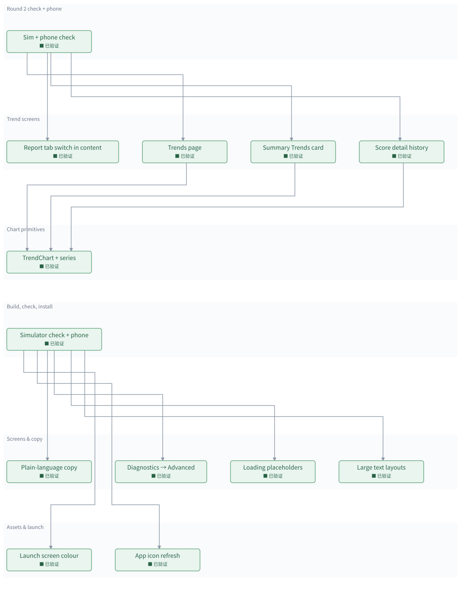

# iOS frontend polish for daily personal use

[所有地图](index.md)

> 自动生成的地图预览；修改地图数据后重新生成。

**当前：** 暂无进行中的模块

已验证 **13 / 13**　｜　回归 **0**

## 分层依赖

· 待开发　⠿ 开发中　■ 已验证　✗ 出现回归　□ 完成但缺少证据

箭头由使用方指向它依赖的模块；基础层位于下方。

## 模块详情

### Round 2 check \+ phone

#### Sim \+ phone check　■ 已验证

Screenshots of report, Trends, score detail; tests; device install; commit and push\.

**依赖：** Trends page、Summary Trends card、Score detail history、Report tab switch in content

**验证记录：** 37 tests pass; installed \+ launched on iPhone; 077cda1 pushed

### Trend screens

#### Report tab switch in content　■ 已验证

Move the Sleep/Activity segmented control from the toolbar principal slot \(clipped by the glass capsule\) into the page under the date title, full width\.

**依赖：** 无

**验证记录：** sim screenshot: full\-width switch under the date

#### Trends page　■ 已验证

Period picker \(7D\-All\); cards for Readiness, Sleep, Activity scores, time in bed with sleep need, steps, active energy, and the four vitals \(tap into the vital page\)\.

**依赖：** TrendChart \+ series

**验证记录：** sim: 7D default, score/sleep/activity/vital cards with phone data

#### Summary Trends card　■ 已验证

Last 7 days: one mini bar row per score with the average; opens the Trends page with a zoom\.

**依赖：** TrendChart \+ series

**验证记录：** sim: 3 mini rows \+ averages; tap on chart opens Trends

#### Score detail history　■ 已验证

ScoreDetailView gains a 30\-day chart of that score under the ring\.

**依赖：** TrendChart \+ series

**验证记录：** sim: Activity 30\-day chart, avg 78 over 3 days

### Chart primitives

#### TrendChart \+ series　■ 已验证

One Swift Charts view for bars or lines over dated values with a date domain, optional reference line, and tap\-to\-read selection; Summary extension turns scores, nights, activity\_daily and vitals into dated series\.

**依赖：** 无

**验证记录：** sim: bars \+ lines render, selection, no clipped labels, flat\-line span fixed

### Build, check, install

#### Simulator check \+ phone　■ 已验证

Unit tests, screenshots in light, dark and AX sizes, then device build, install, commit, push\.

**依赖：** Launch screen colour、App icon refresh、Plain\-language copy、Diagnostics → Advanced、Loading placeholders、Large text layouts

**验证记录：** 37 iOS tests pass; installed \+ launched on iPhone 15 Pro Max; baad169 pushed

### Screens &amp; copy

#### Plain\-language copy　■ 已验证

Replace developer text: the torch\-build note on model\-free nights, jargon \(RMSSD, MET, PWV, segments, fragmentation /h\) and the \+0% digest\. Keep numbers; explain them in words\.

**依赖：** 无

**验证记录：** sim screenshot: Highlights sentence; jargon strings replaced; 37 tests pass

#### Diagnostics → Advanced　■ 已验证

Sync sheet keeps status, Sync Now, and the link policy\. Logs, crashes, older sessions, copy diagnostics, and reset move into an Advanced page\. Settings moves the auth key there too\.

**依赖：** 无

**验证记录：** sim screenshots: sync sheet at medium detent, Advanced page with history/logs/reset

#### Loading placeholders　■ 已验证

First launch shows grey placeholder cards in the Summary layout with a shimmer instead of a bare spinner\. Reduce Motion: no shimmer\.

**依赖：** 无

**验证记录：** builds; not seen on screen \(pairing cover hides first load in the unpaired sim\)

#### Large text layouts　■ 已验证

At accessibility text sizes the three\-ring row and the two\-column vitals grid stack vertically; rings grow with the text\.

**依赖：** 无

**验证记录：** sim at accessibility\-extra\-large: rings as rows, cards stack, no overflow

### Assets &amp; launch

#### Launch screen colour　■ 已验证

LaunchBackground still uses the old warm paper colour, so the app flashes before the grey grouped background\. Match systemGroupedBackground in light and dark\.

**依赖：** 无

**验证记录：** LaunchBackground = F2F2F7 / 000000; build \+ phone launch

#### App icon refresh　■ 已验证

Redraw the 1024 icon in the new style: three concentric score rings \(readiness teal, sleep indigo, activity orange\) on a dark gradient\. Generated locally, no external assets\.

**依赖：** 无

**验证记录：** draw\_app\_icon\.swift \-&gt; 1024 opaque PNG, reviewed; asset compiles

## 验证记录

| 模块 | 状态 | 最近证据 |
| --- | --- | --- |
| Launch screen colour | ■ 已验证 | LaunchBackground = F2F2F7 / 000000; build \+ phone launch |
| App icon refresh | ■ 已验证 | draw\_app\_icon\.swift \-&gt; 1024 opaque PNG, reviewed; asset compiles |
| Plain\-language copy | ■ 已验证 | sim screenshot: Highlights sentence; jargon strings replaced; 37 tests pass |
| Diagnostics → Advanced | ■ 已验证 | sim screenshots: sync sheet at medium detent, Advanced page with history/logs/reset |
| Loading placeholders | ■ 已验证 | builds; not seen on screen \(pairing cover hides first load in the unpaired sim\) |
| Large text layouts | ■ 已验证 | sim at accessibility\-extra\-large: rings as rows, cards stack, no overflow |
| Simulator check \+ phone | ■ 已验证 | 37 iOS tests pass; installed \+ launched on iPhone 15 Pro Max; baad169 pushed |
| Report tab switch in content | ■ 已验证 | sim screenshot: full\-width switch under the date |
| TrendChart \+ series | ■ 已验证 | sim: bars \+ lines render, selection, no clipped labels, flat\-line span fixed |
| Trends page | ■ 已验证 | sim: 7D default, score/sleep/activity/vital cards with phone data |
| Summary Trends card | ■ 已验证 | sim: 3 mini rows \+ averages; tap on chart opens Trends |
| Score detail history | ■ 已验证 | sim: Activity 30\-day chart, avg 78 over 3 days |
| Sim \+ phone check | ■ 已验证 | 37 tests pass; installed \+ launched on iPhone; 077cda1 pushed |

---

静态文档：更新时重新生成地图图片与文字。图中节点不支持拖拽、悬停展开或动画。
