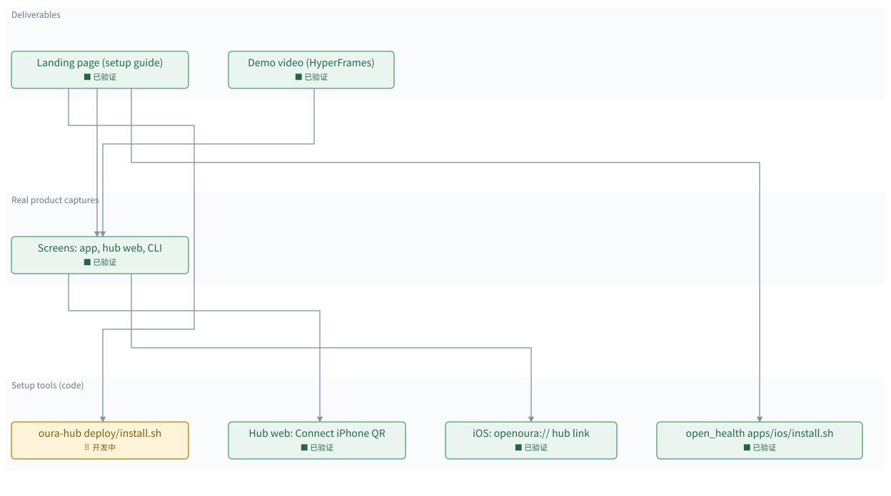

# Launch kit: easier setup, landing page, demo video

[所有地图](index.md)

> 自动生成的地图预览；修改地图数据后重新生成。

**当前：** oura\-hub deploy/install\.sh

已验证 **6 / 7**　｜　回归 **0**

## 分层依赖

· 待开发　⠿ 开发中　■ 已验证　✗ 出现回归　□ 完成但缺少证据

箭头由使用方指向它依赖的模块；基础层位于下方。

## 模块详情

### Deliverables

#### Landing page \(setup guide\)　■ 已验证

Static page: what it is, architecture, step\-by\-step setup for a new user \(ring reset, iPhone app, hub, agent\), troubleshooting\. In open\_oura site/ plus a published Artifact\.

**依赖：** oura\-hub deploy/install\.sh、open\_health apps/ios/install\.sh、Screens: app, hub web, CLI

**验证记录：** site/index\.html written, one look in browser pane; published artifact Kk132vEybKKw5mWNTtPZjT with video \+ images

#### Demo video \(HyperFrames\)　■ 已验证

Short product demo from real captures with music; rendered MP4\.

**依赖：** Screens: app, hub web, CLI

**验证记录：** hyperframes lint 0/0, validate 18 AA, inspect 0 err; 21 snapshots reviewed; render 32\.0s h264\+aac, peak \-3\.2 dB; waveform matches cue sheet

### Real product captures

#### Screens: app, hub web, CLI　■ 已验证

Real screenshots / recordings: iOS simulator with seeded oura\.db, hub web UI on a local hub with real data, terminal output of install \+ MCP call\.

**依赖：** Hub web: Connect iPhone QR、iOS: openoura:// hub link

**验证记录：** 4 iOS sim screens, 12 hub web shots \(light\+dark\), real install\.sh output, real get\_status\_now JSON

### Setup tools \(code\)

#### oura\-hub deploy/install\.sh　⠿ 开发中

One command on the server: detects docker or podman, makes the token, builds, runs as a service, binds the Tailscale address, optional Funnel, prints the web URL, MCP URL, and connect link\. Quadlet unit stops hardcoding Ken's IP\.

**依赖：** 无

**验证记录：** Docker path run end to end\. Gap: podman unit now mounts \~/oura\-hub\-agent/\*; install\.sh must mkdir them \(edit blocked by auto\-mode classifier\)

#### Hub web: Connect iPhone QR　■ 已验证

Signed\-in web UI shows a QR of openoura://hub?url=&lt;origin&gt;&amp;token=&lt;token&gt; and the MCP URL / claude mcp add command to copy\.

**依赖：** 无

**验证记录：** svelte\-check 0 errors; vite build; browser: \#token= link signs in and opens Connect; BarcodeDetector decodes QR to the exact openoura:// link

#### iOS: openoura:// hub link　■ 已验证

App registers the openoura URL scheme; onOpenURL parses HubLink and asks with a UIKit alert on the top screen \(works over the pairing cover; re\-asks if the cover closes under it\)\. Connect sets URL \+ token, switches the hub on, resets replication for a new host, and pushes\. First SwiftUI\-alert version crashed \(3 alerts on one state\) and was replaced\.

**依赖：** 无

**验证记录：** HubPushTests 9/9 in sim; openoura:// link → UIKit prompt → Connect pushed summary \+ 116,890 events to local hub; cold launch OK

#### open\_health apps/ios/install\.sh　■ 已验证

One command from a clean clone to the app on the phone: checks tools, builds the xcframework, xcodegen, detects the team ID and the connected iPhone, builds, installs, launches\. Re\-run every 7 days\.

**依赖：** 无

**验证记录：** \-\-check found team \+ iPhone; the script's xcodebuild line built and signed for the phone \(BUILD SUCCEEDED\); install step not run on purpose

## 验证记录

| 模块 | 状态 | 最近证据 |
| --- | --- | --- |
| oura\-hub deploy/install\.sh | ⠿ 开发中 | Docker path run end to end\. Gap: podman unit now mounts \~/oura\-hub\-agent/\*; install\.sh must mkdir them \(edit blocked by auto\-mode classifier\) |
| Hub web: Connect iPhone QR | ■ 已验证 | svelte\-check 0 errors; vite build; browser: \#token= link signs in and opens Connect; BarcodeDetector decodes QR to the exact openoura:// link |
| iOS: openoura:// hub link | ■ 已验证 | HubPushTests 9/9 in sim; openoura:// link → UIKit prompt → Connect pushed summary \+ 116,890 events to local hub; cold launch OK |
| open\_health apps/ios/install\.sh | ■ 已验证 | \-\-check found team \+ iPhone; the script's xcodebuild line built and signed for the phone \(BUILD SUCCEEDED\); install step not run on purpose |
| Screens: app, hub web, CLI | ■ 已验证 | 4 iOS sim screens, 12 hub web shots \(light\+dark\), real install\.sh output, real get\_status\_now JSON |
| Landing page \(setup guide\) | ■ 已验证 | site/index\.html written, one look in browser pane; published artifact Kk132vEybKKw5mWNTtPZjT with video \+ images |
| Demo video \(HyperFrames\) | ■ 已验证 | hyperframes lint 0/0, validate 18 AA, inspect 0 err; 21 snapshots reviewed; render 32\.0s h264\+aac, peak \-3\.2 dB; waveform matches cue sheet |

---

静态文档：更新时重新生成地图图片与文字。图中节点不支持拖拽、悬停展开或动画。
